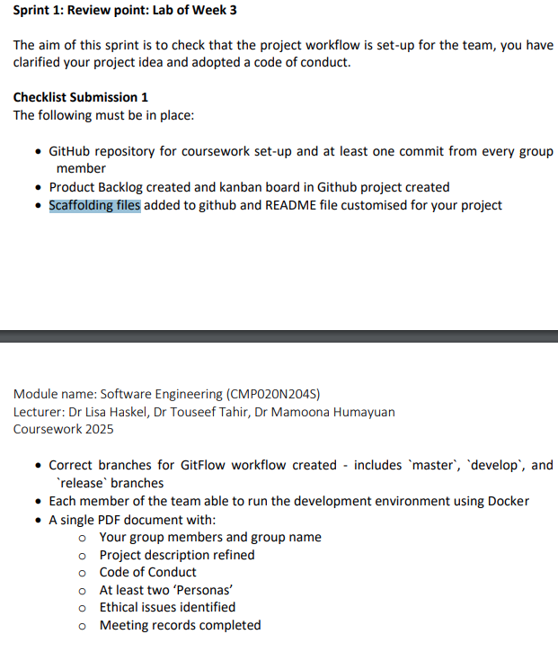

# MySQL, PHPMyAdmin and Node.js (ready for Express development)

This will install Mysql and phpmyadmin (including all dependencies to run Phpmyadmin) AND node.js

This receipe is for development - Node.js is run in using supervisor: changes to any file in the app will trigger a rebuild automatically.

For security, this receipe uses a .env file for credentials.  A sample is provided in the env-sample file. If using these files for a fresh project, copy the env-sample file to a file called .env.  Do NOT commit the changed .env file into your new project for security reasons (in the node package its included in .gitignore so you can't anyway)

In node.js, we use the MySQl2 packages (to avoid problems with MySQL8) and the dotenv package to read the environment variables.

Local files are mounted into the container using the 'volumes' directive in the docker-compose.yml for ease of development.

### Super-quickstart your new project:

* Make sure that you don't have any other containers running usind docker ps
* run ```docker-compose up --build```

#### Visit phphmyadmin at:

http://localhost:8081/

#### Visit your express app at:

http://localhost:3000

For reference, see the video at: https://roehampton.cloud.panopto.eu/Panopto/Pages/Viewer.aspx?id=6f290a6b-ba94-4729-9632-adcf00ac336e

NB if you are running this on your own computer rather than the azure labs that has been set up for you, you will need to install the following:

* node.js  (windows: https://nodejs.org/en/download/)
* docker desktop (for windows, this will also prompt you to install linux subsystem for windows https://docs.docker.com/desktop/windows/install/ )

### Whats provided in these scaffolding files?


  * A docker setup which will provide you with node.js, mysql and phpmyadmin, including the configuration needed so that both node.js AND phpmyadmin can 'see' and connect to your mysql database.  If you don't use docker you'll have to set up and connect each of these components separately.
  * A basic starting file structure for a node.js app.
  * A package.json file that will pull in the node.js libraries required and start your app as needed.
  * A db.js file which provides all the code needed to connect to the mysql database, using the credentials in the .env file, and which provides a query() function that can send queries to the database and receive a result.  In order to use this (ie. interact with the database, you simply need to include this file in any file you create that needs this database interaction) with the following code:

```const db = require('./services/db');
```

____

Useful commands:

Get a shell in any of the containers

```bash
docker exec -it <container name> bash -l
```

Once in the database container, you can get a MySQL CLI in the usual way

```bash
mysql -uroot -p<password> 
```
# Sprint_1_SoftwareEng
 Sprint 1 group work for Software Engineering

If you are editing this file please add a new branch dont forgot that.

Make sure before updating and pushing code or any changes , pull orgin first then commit your changes to main

Just testing the sync on my laptop and computer
This is epic. If your reading this I am testing code sync on 2 different devices

This for the breif here:
---->     https://moodle.roehampton.ac.uk/pluginfile.php/4735021/mod_resource/content/7/SECoursework2025.pdf   <----

requirments :
     --->  https://moodle.roehampton.ac.uk/pluginfile.php/5017988/mod_resource/content/8/Group%20project%20requirements.pdf <---


Check list:
